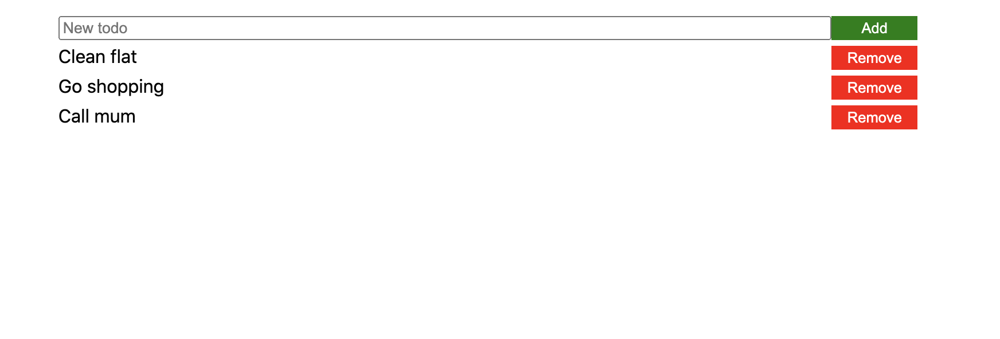

# Todo List

## Features in this branch

- CSS Layout reworked (everything based on Flexbox layout, see [https://css-tricks.com/snippets/css/a-guide-to-flexbox/](https://css-tricks.com/snippets/css/a-guide-to-flexbox/))
- datepicker component (`src/components/datepicker.vue`)
- todo component (`src/components/todo.vue`)

## Task: Improve the todo list

Based on the code in this repository, a new version should be developed.

### Mockup of the User Interface




### List of requirements


### Non-functional
- List of todos should be sorted descending according to due date
- Future todos should be coloured green
- Today’s todos should be coloured red
- Past todos should be coloured grey
- The date chooser should stay consistent (i.e., number of days per month)

### Functional
- Clicking the Add Todo button should add a todo if the text field is not empty
- Clicking remove should remove the respective todo from the list
- The T button should set the date chooser to today

## Implementation

We already did most of the implementation in class on Friday 28. November.

I will quickly repeat step-by-step what we did:

### 1. Import the datepicker component

This piece of code can be used to import the component at the beginning of the script section.

```javascript
import datepicker from './components/datepicker.vue'
```

### 2. Make the datepicker component available for the template

Include the datepicker component in the components object.

```javascript
components: {
    // Add the datepicker here...
}
```

Now the datepicker can be used in the `template`section.

### 3. Add a datepicker UI element

In the template section, add a `datepicker` element right after the `input` element. Simply add a

```html
<datepicker/>
```

If you have the development server running, you should see the datepicker appear on the webpage.

### 4. Add a data element for the Todo date

The `data()` function currently looks like this:

```javascript
  data() {
    return {
      newTodoText: "",
      todos: [],
    };
  },
```

Add a `newTodoDate` element here and initialise it with an empty string (`newTodoDate: ""`).

### 5. Update addTodo()

The function `addTodo` currently pushes an object consisting of a `text` and an `id` field to the list `this.todos` (you can ignore the `done`field for the moment). Add a `date` field and set it to `this.newTodoDate`.

### 6. Add a new method `dateUpdated`

In the `methods` object in the `<script>...</script>` section, add a function that takes a date as an argument:

```js
dateUpdated (date) {
    this.newTodoDate = date.clone()
}
```

#### JavaScript quirk:
> Here it is very important to `clone()` the date object (otherwise we would always refer to the same date object and all todo items would have the *same* date).

### 7. Add event handler to the datepicker

Go to the `<template>...</template>` section and add the `dateUpdated` method as an event handler for the `updated` event.

This is the corresponding code:

```
v-on:update="dateUpdated"
```

### 8. Display the todo dates

In the current version, the todo list consists of a header and data rows below.

The header currently is

```html
<li class="todo">
    <span class="todo-text list-header">Todo</span>
    <span class="todo-empty-button list-header"></span>
</li>
```

Add the code

```html
<span class="todo-date list-header">Due date</span>
```

to the correct position.

The display order in a row should be 
1. todo text
2. todo date

A data row is displayed with

```html
<li class="todo" v-for="todo in todos" :key="todo.id">
    <span class="todo-text">{{ todo.text }}</span>
    <button class="todo-remove-button" v-on:click="removeTodo(todo)">Remove</button>
</li>
```

Add the code for displaying the todo date

```html
<span class="todo-date">{{ todo.date.format('MM-DD-YYYY') }}</span>
```

to the correct position.


The code

```js
todo.date.format('MM-DD-YYYY')
```

is used to create a nice formatting of the date.

Now, if you go to the webpage again, you should be able to add and remove todos with dates. We did all this in class last Friday, please also watch the Zoom recording carefully if you run into troubles.

## Next steps

What's still missing is the correct order and the colouring of the todos. Todos should be sorted by date, past todos should be displayed with gray background, todays todos should be red, and future todos should be green.

### 9. Sort the todos

Whenever a new todo item is pushed to the list of todos, the list should be sorted. 

Where in the code are items add to the list `this.todos`?

After this happens, you should add the code

```js
this.todos.sort((todoA, todoB) => -todoA.date.diff(todoB.date))
```

to sort the todos by date.

Don't worry too much about how the sorting works (if you want to know it, have a look at [https://developer.mozilla.org/en-US/docs/Web/JavaScript/Reference/Global_Objects/Array/sort](https://developer.mozilla.org/en-US/docs/Web/JavaScript/Reference/Global_Objects/Array/sort)), but it's important to know where the sort should happen.

After that, todos should be correctly sorted on the webpage.

### 10. Color of todos

To set the correct colour for todos, it would be necessary to write a method that compares the date of a todo item with the current date. For convenience, I have already done this for you, and you have to include the `todo` component from (`src/components/todo.vue`) in your code.

Remember how you included the `datepicker` component. You have to do the same thing for the `todo` component (i.e., import the component and add it to the components object).

In the `<template>...</template>` section, you can simply replace the existing code for displaying data rows

```html
<span class="todo-text">{{ todo.text }}</span>
<span class="todo-date">{{ todo.date.format('MM-DD-YYYY') }}</span>
<button class="todo-remove-button" v-on:click="removeTodo(todo)">Remove</button>
```

with the code for the todo component

```html
<todo :todo="todo" v-on:remove="removeTodo(todo)"/>
```

Note that in the previous code, the `removeTodo()` function was called when the remove button was clicked, but in the todo component this button is already included, and the component sends a `remove` event whenever the button is clicked. So we can should listen to the `remove` event instead and call the `removeTodo()` function whenever it occurs.

If everything went well, you should see a coloured list of todo items and all the requirements should be met.

## Upload the code

To push all your current code back to the Github repo, you should have a commandline window open, go to your project directory, and switch to the branch `feat/better-styling`

Then:

### 1. Add all local changes to the next commit ("staging area")

```
git add . 
```

### 2. Commit all changes to your local repo

```
git commit -m "todo list with correct order and colours"
```

### 3. Push everything back to Github

```
git push -u origin feat/better-styling
```

This pushes your local repo back to Github ("origin") and also creates a branch `feat/better-styling` there.